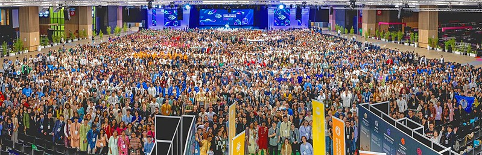
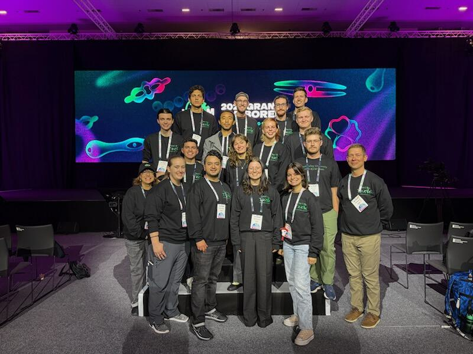

```{r setup, include=FALSE}
knitr::opts_chunk$set(echo = TRUE)
```

I am currently a student at Utah Valley University studying biotechnology and microbiology. My hope is to use my education to help resolve anthropomorphic damage done to ecosystems around the globe to make life better for humans and all other living organisms.

## Research
### iGEM 2024

In 2024, I was privileged to be on the UVU iGEM team under the tutelage of Dr. Eric Domyan and Dr. Colleen Hough despite my inexperience in the field at the time. iGEM, International Genetically Engineered Machine, is an international organization that hosts an annual competition in which teams attempt to tackle issues ranging from the climate crisis to medicine and space. Our team attempted to engineer a microalga, *Chlamydomonas reinhardtii*, to remove excess nitrogen and phosphorus from waterways that are largely responsible for harmful algae blooms across the world. For more information on the project, you can [visit our page](https://2024.igem.wiki/uvu-utah-2/index.html).





### Ovarian Cancer

Ovarian cancer is a prevalent and deadly gynecological cancer that often goes undiagnosed until the later stages of cancer development. With the guidance of Dr. Kiara Whitley, our team is working to determine if human epididymis protein 4 (HE4) can be used as a biomarker to diagnose cancer at early stages of cancer development. We are still in the early stages of research and are currently growing up stocks of a variety of cancer cells for experimentation and analysis.

### American Chestnut 

As part of the Microbial Genetics course (MICR3650), we began a research project to address the near functional extinction of the American Chestnut, *Castanea dentata*, in its native range, under the direction of Dr. Margie Beucher. This ecosystem-altering change was brought about by chestnut blight, a disease caused by the fungal pathogen *Cryphonectria parasitica*, which also affects other *Castanea* species. Our goal was to engineer *Bacillus subtilis*, a natural endophyte and soil microbe, to secrete an enzyme that would stop the pathogen from getting through the outer layers of the tree and allow the tree to grow unimpeded by the fungus.

### iGEM 2026

After a year off, UVU has decided to field another iGEM team with Dr. Eric Domyan and Dr. Colleen Hough taking lead again. This year's project is again working with *Chlamydomonas reinhardtii* but we are instead working on the degradation of atrazine, a common herbicide that has been identified as an endocrine-disruptor and a persistent environmental pollutant. We are in the early stages of research at this point in time and my [BIOL3100 final project](./final_project/Final_Project.html) is about our research.


[Return to homepage](../index.html)