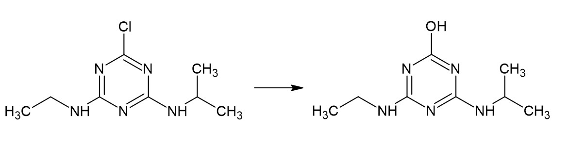

```{r setup, include=FALSE}
knitr::opts_chunk$set(echo = TRUE)
library(tidyverse)
library(easystats)
library(dplyr)
library(ggplot2)
library(modelr)
library(GGally)
library(skimr)
library(stringr)
atrazine_assay=read.csv('atrazine_assay.csv')
```

## Introduction

A research group I am part of is working on engineering a micro algae, *Chlamydomonas reinhardtii*, to degrade atrazine, a widely used herbicide that persists in the environment and is a known endocrine disruptor.^1^ We are still in the beginning stages of research, but have run a few assays to test the viability of the enzymes we are testing, wild-type AtzA (wt-AtzA), modified AtzA (mut-AtzA), and TrzN. In addition, TrzN has shown the capability to dechlorinate other compounds and we plan to test its ability to do so at a later date.

## Background

The first step in our lab work was to design the plasmids to be cloned into Escherichia coli since it has a shorter generation time and is generally easier to work with than *C. reinhardtii*. After designing and ordering the plasmids, they were cloned into *E. coli* and selected for using blue-white colony screening. The selected colonies were then grown in LB with kanamycin before being induced for expression of their respective enzyme and samples were extracted at predetermined time intervals ending at 24 hours. The collections were then analyzed via SDS-PAGE and it was determined that the enzymes were being produced; however, they were found in the insoluble fraction, indicating that they were not folding properly. After several additional rounds of induction with different reagents and lowered incubator temperatures, there appeared to be enough protein in the soluble fraction to move forward. Our current aim is to determine the enzyme that most effectively dechlorinates atrazine into hydroxyatrazine.




## Data

The data for this analysis is pulled from our experimental results on the inductions and the atrazine assays. The solution for the assay was 0.1M sodium phosphate at pH 7.4 to which atrazine was added to create a solution of about 30 mg/L. The first assay was done with just the wt-AtzA and a control and the OD wavelengths monitored and recorded for atrazine degradation were 262 and 222. The second assay was done with the same solution but with all three enzymes. In addition to the previously monitored wavelengths, we monitored and recorded 234 for hydroxyatrazine. Both assays ran for approximately 22 hours. I compiled the data from the notebook into a csv file, so no data cleaning was required.
```{r structure}
#structure of data file
str(atrazine_assay)
```


```{r head}
#show first few lines of data
head(atrazine_assay)
```

There were five time points at which the absorbance was measured in the first assay while the second assay had six time points for each enzyme. Here is a brief description of each column:
- **Assay:** only two assays have been run thus far and have been labeled as 1 and 2 for the first and second, respectively.
- **Enzyme:** the enzymes are listed as “wt” for wild-type AtzA, “mut” for the modified AtzA, and TrzN for TrzN.
- **Time:** is for time in minutes (1320 is 22 hours).
- **Wavelength:** is the optical density that help identify the chemical compounds present.
- **Absorbance:** is a measurement of the amount of light that does not pass through the sample into the sensor.

## Analysis

As previously stated, the goal is to determine the most effective enzyme. While the lysate is impure and a good amount of the enzymes are not folded quite right, meaning we can’t make any definitive conclusions, this is an important step to see if the enzymes work at all.

```{r plot analysis}
#plot comparing the degradation of atrazine and formation of hydroxyatrazine by enzyme
atrazine_assay %>%
  ggplot(aes(x=Time,y=Absorbance,color=Enzyme))+
  geom_point()+
  geom_smooth(method = 'glm', se = FALSE, aes(group = Enzyme))+
  facet_grid(Assay~Wavelength,scales='free_y')+
  labs(title = 'Enzymatic Activity Assay',
       x='Time (minutes)',
       y= 'Absorbance')
```

While more work needs to be done to make the data between the enzyme types comparable, and to record more data between the penultimate and ultimate time points, the data indicates that both the AtzA enzymes are degrading atrazine into hydroxyatrazine. Focusing in on the control and TrzN plots, TrzN looks like it isn’t degrading atrazine, which could be due to a variety of factors including a greater difficulty in proper folding and not enough zinc in solution as a cofactor.

## Model Analysis

```{r model}
#setting up the model
mod=glm(Absorbance~Time,data = atrazine_assay)
report(mod)
```

As shown by the model analysis, the data doesn’t fit the model very well. This could be due to too few data points, the degradation of enzymes over time in particular regards to the last data point, or other reasons not yet explored.


### Reference
1. Jin, C., Hao, R., Ren, X., & Shen, J. (2026). Novel mechanisms of atrazine endocrine disruption: an integrated approach reveals progesterone and glucocorticoid receptor targeting. *BMC Pharmacology & Toxicology, 27*(1), 39. https://doi.org/10.1186/s40360-026-01096-1


[Return to homepage](../index.html)